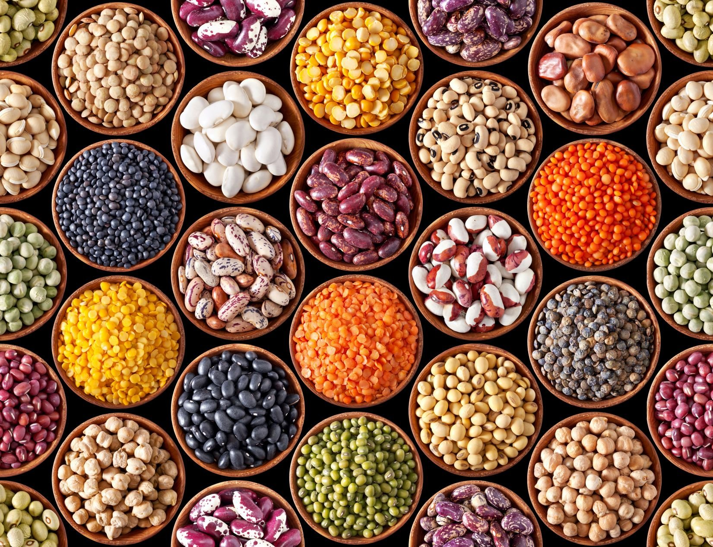
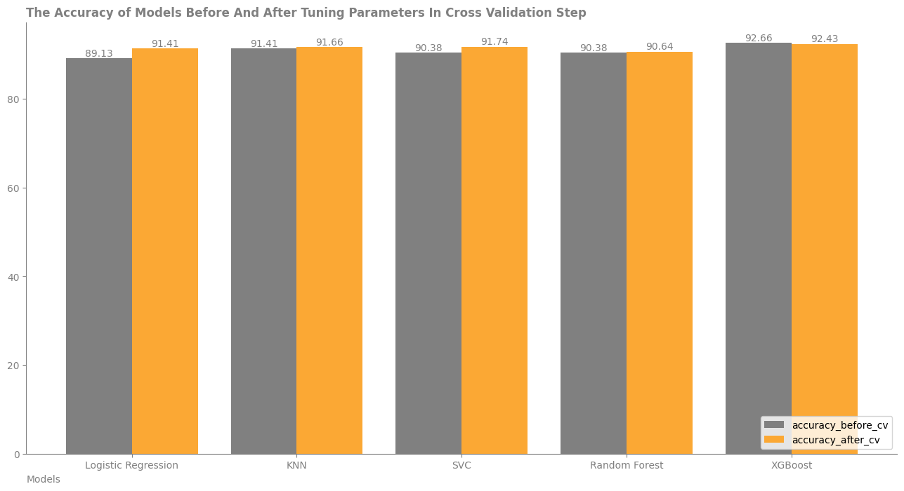

# Dry Bean Data Analysis And ML Modeling

The data set is about classification of dry beans. There are 16 feature and one target named "Class". Some features like Area are directly comes from shape of beans and some of them like ShapeFactor1 are combination of other features. For example: 
* Area(A) comes from "The area of a bean zone and the number of pixels within its boundaries". 
* Also ShapeFactor1 comes from ShapeFactor1(SF1) = L/A. Other formulas are [here](https://doi.org/10.1016/j.compag.2020.105507).

Features are:
* Area (A): The area of a bean zone and the number of pixels within its boundaries.
* Perimeter (P): Bean circumference is defined as the length of its border.
* Major axis length (L): The distance between the ends of the longest line that can be drawn from a bean.
* Minor axis length (l): The longest line that can be drawn from the bean while standing perpendicular to the main axis.
* Aspect ratio (K): Defines the relationship between L and l.
* Eccentricity (Ec): Eccentricity of the ellipse having the same moments as the region.
* Convex area (C): Number of pixels in the smallest convex polygon that can contain the area of a bean seed.
* Equivalent diameter (Ed): The diameter of a circle having the same area as a bean seed area.
* Extent (Ex): The ratio of the pixels in the bounding box to the bean area.
* Solidity (S): Also known as convexity. The ratio of the pixels in the convex shell to those found in beans.
* Roundness (R): Calculated with the following formula: (4piA)/(P^2)
* Compactness (CO): Measures the roundness of an object: Ed/L
* ShapeFactor1 (SF1)
* ShapeFactor2 (SF2)
* ShapeFactor3 (SF3)
* ShapeFactor4 (SF4)
* Class (Seker, Barbunya, Bombay, Cali, Dermosan, Horoz and Sira)

For modeling data, **five** different models were used:
* **Logistic Regression**
* **KNN**
* **SVC**
* **Random Forest**
* **XGBoost**

Finally they will be compared each other. 

## Code structure

```
├── Dry_Bean_Dataset.xlsx
├── images
├── dry_bean.ipynb
├── README.md
└── .gitignore
```

## Data section

* Data structure description
    - List of tables
        - bean_df
    - File formats
        - xlsx file

## Results

Totally all result, before and after cross validation step, were shown in next bar plot. 

